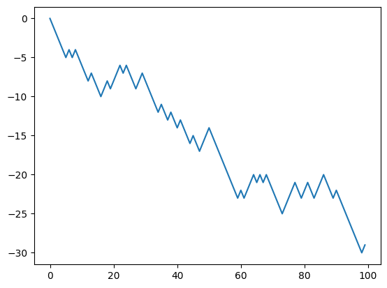
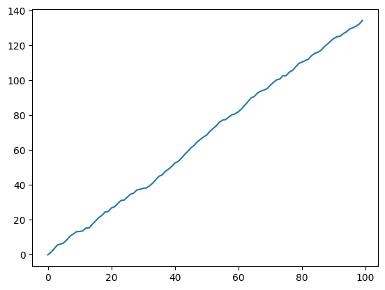
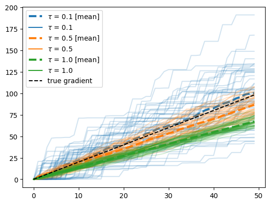
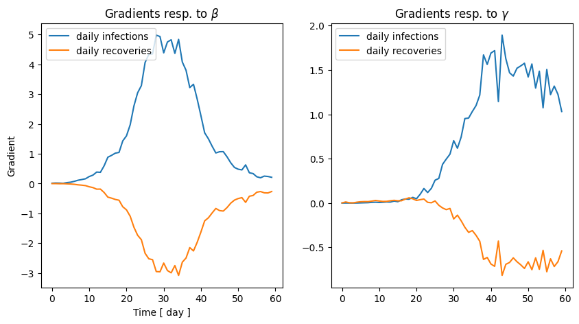

```python
import torch
import numpy as np
import matplotlib.pyplot as plt
```

# Differentiable Agent-Based Models

We are now in a good spot to code our first differentiable ABM. Refer to notebooks 1 and 2 for a review of automatic differentiation (AD).

# 1. Random Walk

Let us first consider a very simple ABM: a 1-dimensional random walk. The model is defined through the recursion

$$
\begin{align}
\xi &\sim \mathrm{Bernoulli}({\theta}),\\
x_{t+1} &= x_t + \begin{cases}1 &\mathrm{if} &\xi = 1 \\ -1 &\mathrm{if} &\xi = 0\end{cases}
\end{align}
$$

A first naive implementation using PyTorch might be:


```python
def random_walk(theta, n_timesteps):
    x = torch.tensor([0.])
    for i in range(n_timesteps-1):
        xi = torch.distributions.Bernoulli(theta).sample()
        if xi == 1:
            next_x = x[-1] + 1
        else:
            next_x = x[-1] - 1
        x = torch.hstack((x, next_x))
    return x
```


```python
theta = 0.2
n_timesteps = 100
x = random_walk(theta, n_timesteps)
plt.plot(x)
```


    [<matplotlib.lines.Line2D at 0x13eb442e0>]


    

    


Let us now compute the Jacobian

$$
(J)_i = \frac{\partial {x_i}}{\partial \theta}
$$

which we will later use for calibration. If we try to use torch's autograd to compute the jacobian:


```python
dx_dtheta = torch.autograd.functional.jacobian(
    lambda x: random_walk(theta=x, n_timesteps=n_timesteps), torch.tensor(theta)
)
plt.plot(dx_dtheta)
```


    [<matplotlib.lines.Line2D at 0x13ec03790>]


    

    


We obtain a gradient of 0. Why is that? There are two reasons:

1. As we noted in the previous tutorials, the Bernoulli distribution is not automatically differentiable, and we need to use a continuous relaxation such as Gumbel-Softmax.
2. AD frameworks such as PyTorch require a static computation graph to perform AD. Even though they support control flow statement such as `if` or `else`, they do not support control flow statements that depend on the parameters that we want to differentiate to. This can be circumvented by using masks. That is, a statement

```python
xi = torch.distributions.Bernoulli(theta)
if x:
    return a
else:
    return b
```

can be written as

```python
xi = torch.distributions.Bernoulli(theta)
y = xi * a + (1-xi) * b
```

with this in mind, we can rewrite our example as:


```python
def random_walk(theta, n_timesteps, tau=0.1):
    x = torch.tensor([0.0])
    for i in range(n_timesteps - 1):
        logits = torch.hstack((theta, 1 - theta)).log()
        xi = torch.nn.functional.gumbel_softmax(logits, tau=tau, hard=True)[0]
        next_x = x[-1] + 2 * xi - 1
        x = torch.hstack((x, next_x))
    return x
```


```python
theta = torch.tensor(0.4)
n_timesteps = 100
x = random_walk(theta, n_timesteps)
plt.plot(x)
```


    [<matplotlib.lines.Line2D at 0x13ec7bbb0>]


    

    


Now, remember, because of the `hard=True` the forward simulation is identical to the previous case. That is, the continuous relaxation that we model with Gumbel-Softmax only affects the backward gradient propagation. Let us now recompute the jacobian:


```python
dx_dtheta = torch.autograd.functional.jacobian(
    lambda x: random_walk(theta=x, n_timesteps=n_timesteps, tau=1.0), theta
)
plt.plot(dx_dtheta)
```


    [<matplotlib.lines.Line2D at 0x13f103160>]


    

    


and now we have a gradient! The temperature parameter of the GS distribution entails a bias-variance tradeoff as explained in the previous notebook. Let's analyze the effect here.


```python
taus = [0.1, 0.5, 1.0]
n_gradient_samples = 50
n_timesteps = 50
gradients_per_tau = {tau: [] for tau in taus}
for tau in taus:
    for i in range(n_gradient_samples):
        dx_dtheta = torch.autograd.functional.jacobian(
            lambda x: random_walk(theta=x, n_timesteps=n_timesteps, tau=tau),
            theta,
            vectorize=True,
        )
        gradients_per_tau[tau].append(dx_dtheta)
```


```python
fig, ax = plt.subplots()
for i, tau in enumerate(gradients_per_tau):
    for grad in gradients_per_tau[tau]:
        ax.plot(grad, color=f"C{i}", alpha=0.2)
    ax.plot(
        sum(gradients_per_tau[tau]) / n_gradient_samples,
        color=f"C{i}",
        linestyle="--",
        label=rf"$\tau$ = {tau} [mean]",
        lw=3
    )
    ax.plot([], [], color=f"C{i}", label=rf"$\tau$ = {tau}")
ax.plot(
    range(n_timesteps),
    2 * np.array(range(n_timesteps)),
    color="black",
    linestyle="--",
    label="true gradient",
)
ax.legend()
```


    <matplotlib.legend.Legend at 0x13eb44b80>


    

    


First let's address how we obtained the true gradient value by the black dashed line $y=x$. Since the random walk is a linear model, we can write

$$
\begin{align}
\frac{\partial}{\partial \theta} \mathbb E[x_N]  & = \frac{\partial}{\partial \theta} \mathbb E\left[ \sum_{j=1}^{N} 2 \mathrm{Bernoulli(\theta)} - 1 \right]\\
                                                 & = \frac{\partial}{\partial \theta} (2  N  \theta - N) \\
                                                 & = 2 N
\end{align}
$$

Second, we observe that for decreasing values of $\tau$, the mean of the gradient estimate gets closer to the true values, but the variance increases significantly. In this particular case, we may do better with $\tau=0.5$ than $\tau=0.1$ since the small bias is an acceptable trade for a big reduction in variance.

# 2. SIR model

Let us know code a differentiable Susceptible-Infected-Recovered epidemiological model. The ABM is a discretization of the system of equations

$$
\begin{align}
\frac{\mathrm{d} S}{\mathrm{d} t} &= - \beta SI \\
\frac{\mathrm{d} I}{\mathrm{d} t} &=  \beta SI - \gamma I\\
\frac{\mathrm{d} R}{\mathrm{d} t} &= \gamma I \\
\end{align}

$$

where $\beta$ is the effective contact rate (higher values correspond to faster disease spread), and $\gamma$ is the recovery rate (e.g., a $\gamma =0.05$ corresponds to a mean recovery time of 20 days), and S, I, R are the fraction of susceptible, infected, and recovered individuals respectively.

The corresponding ABM can be obtained by considering a collection of $N$ agents. At each time-step, the probability of agent $i$ getting infected is given by

$$
p_i = 1 - \exp{\left(-\beta I \Delta t\right)},
$$

where $I$ is the fraction of individuals infected at this time, and $\Delta t$ is the duration of the time-step. Likewise, an infected individual can recover with probability

$$
q_i = 1 - \exp{\left(-\gamma \Delta t\right)}.
$$


```python
def sample_bernoulli(p, tau):
    logits = torch.vstack([p, 1 - p]).t().log()
    return torch.nn.functional.gumbel_softmax(logits=logits, tau=tau, hard=True)[:, 0]


def sir(
    beta, gamma, initial_fraction_infected, n_agents, n_timesteps, delta_t, tau=0.5
):
    # here S, I, R denote arrays of size (n_agents, ) with 1 or 0 depending on their state.
    I = sample_bernoulli(initial_fraction_infected * torch.ones(n_agents), tau)
    S = 1.0 - I
    R = torch.zeros(n_agents)
    infections_per_timestep = torch.tensor([])
    recoveries_per_timestep = torch.tensor([])
    for _ in range(n_timesteps):
        # sample probs
        probs_infected = S * (1.0 - torch.exp(-beta * sum(I) / n_agents * delta_t))
        probs_infected = torch.clip(probs_infected, 1e-8, 1.0)
        is_infected = sample_bernoulli(probs_infected, tau)
        probs_recovery = I * (1.0 - torch.exp(-gamma * delta_t))
        probs_recovery = torch.clip(probs_recovery, 1e-8, 1.0)
        is_recovered = sample_bernoulli(probs_recovery, tau)
        # update
        S = S - is_infected
        I = I + is_infected - is_recovered
        R = R + is_recovered
        # save
        infections_per_timestep = torch.hstack(
            (infections_per_timestep, is_infected.sum() / n_agents)
        )
        recoveries_per_timestep = torch.hstack(
            (recoveries_per_timestep, is_recovered.sum() / n_agents)
        )
    return infections_per_timestep, recoveries_per_timestep
```


```python
beta = torch.tensor(0.2)
gamma = torch.tensor(0.05)
initial_fraction_infected = 0.01
n_agents = 10000
n_timesteps = 60
delta_t = 1

inf_t, rec_t = sir(beta, gamma, initial_fraction_infected, n_agents, n_timesteps, delta_t)
```


```python
fig, ax = plt.subplots()
ax.plot(inf_t, label = "Daily infections")
ax.plot(rec_t, label = "Daily recoveries")
ax.set_xlabel("Time [ day ]")
ax.set_ylabel("Population fraction")
ax.legend()
```


    <matplotlib.legend.Legend at 0x13f188f70>


    

    


## 2.2 Gradients of the SIR model

Similarly as the random walk model, we can now easily obtain the gradients of the infections and recoveries time-series.


```python
# fixed parameters
initial_fraction_infected = 0.01
n_agents = 1_000
delta_t = 1
n_timesteps = 60
def faux(x):
    beta, gamma = x
    return sir(beta, gamma, initial_fraction_infected, n_agents, n_timesteps, delta_t)

beta = 0.2
gamma = 0.05
jacobian = torch.autograd.functional.jacobian(faux, torch.tensor([beta, gamma]), vectorize=True)
```


```python
fig, ax = plt.subplots(1, 2, figsize=(10, 5))
ax[0].plot(jacobian[0][:,0], label = "daily infections")
ax[0].plot(jacobian[0][:,1], label = "daily recoveries")
ax[0].set_title(r"Gradients resp. to $\beta$")
ax[0].legend()
ax[1].plot(jacobian[1][:,0], label = "daily infections")
ax[1].plot(jacobian[1][:,1], label = "daily recoveries")
ax[1].set_title(r"Gradients resp. to $\gamma $")
ax[1].legend()
ax[0].set_xlabel("Time [ day ]")
ax[0].set_ylabel("Gradient")
```


    Text(0, 0.5, 'Gradient')


    

    


## 2.3 Fitting by gradient descent

It's about time to do what we set up to do with this tutorial: using the gradients to calibrate our model.

Let's assume we have an observed (multivariate) time-series $\mathbf y$. We want to compute the "optimal" values of $\beta$ and $\gamma$ that generate $\mathbf x$ that is as close as possible as $\mathbf y$. More specifically, we want to compute

$$
(\beta^*, \gamma^*) = \argmin_{(\beta, \gamma)} \ell \, \left(\mathbf x(\beta, \gamma), \mathbf y\right)
$$

where $\ell$ is an appropritate distance function. In this case, we will just consider the standard L2 loss.


```python
# let's generate some fake observation data first
true_beta = torch.tensor(0.2)
true_gamma = torch.tensor(0.05)
true_inf, true_rec = sir(
    true_beta, true_gamma, initial_fraction_infected, n_agents, n_timesteps, delta_t
)
# let's add some observation noise
sigma_obs = 0.05
true_inf = true_inf + torch.randn(n_timesteps) * sigma_obs * true_inf
true_rec = true_rec + torch.randn(n_timesteps) * sigma_obs * true_rec

f, ax = plt.subplots(1, 1)
ax.plot(true_inf, label = "daily infections")
ax.plot(true_rec, label = "daily recoveries")

```


    [<matplotlib.lines.Line2D at 0x14f4fd120>]


    

    


```python
# now let's find the best fit through gradient descent and try to recover the true parameters
# one thing to consider is that gradient descent is not a constrained optimization method
# so to avoid beta and gamma to go negative we will use a log transformation
log_beta = torch.tensor(0.0, requires_grad=True)
log_gamma = torch.tensor(0.0, requires_grad=True)
def loss(log_beta, log_gamma, obs_inf, obs_rec):
    beta = 10 ** log_beta
    gamma = 10 ** log_gamma
    inf, rec = sir(beta, gamma, initial_fraction_infected, n_agents, n_timesteps, delta_t)
    return torch.sum((inf - obs_inf) ** 2 + (rec - obs_rec) ** 2)

from tqdm import tqdm

n_epochs = 200
loss_hist = []
beta_hist = []
gamma_hist = []
optimizer  = torch.optim.Adam([log_beta, log_gamma], lr=0.05)
for i in tqdm(range(n_epochs)):
    optimizer.zero_grad()
    l = loss(log_beta, log_gamma, true_inf, true_rec)
    l.backward()
    # clip norm this is important to avoid exploding gradients
    torch.nn.utils.clip_grad_norm_([log_beta, log_gamma], 1)
    optimizer.step()
    loss_hist.append(l.item())
    beta_hist.append(10 ** log_beta.item())
    gamma_hist.append(10 ** log_gamma.item())
```

    100%|██████████| 200/200 [01:22<00:00,  2.43it/s]


```python
# let's see the results
fig, ax = plt.subplots(1, 2, figsize=(10, 5))
ax[0].plot(loss_hist)
ax[0].set_title("Loss")
ax[0].set_xlabel("Epoch")
ax[0].set_ylabel("Loss")
ax[1].set_title("Estimated parameters")
ax[1].plot(beta_hist, label = "Estimated beta", color = "C0")
ax[1].plot(gamma_hist, label = "Estimated gamma", color = "C1")
ax[1].axhline(true_beta, color="C0", linestyle="--", label="True beta")
ax[1].axhline(true_gamma, color="C1", linestyle="--", label="True gamma")
ax[1].set_xlabel("Epoch")
ax[1].legend()

```


    <matplotlib.legend.Legend at 0x14f4d9300>


    

    


```python

```
