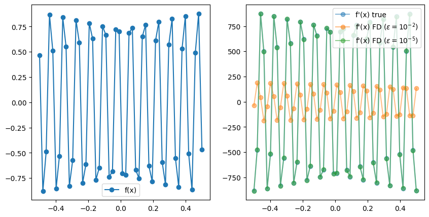

```python
import matplotlib.pyplot as plt
import torch
import sympy
import numpy as np
```

# Automatic Differentiation

Automatic differentation (AD) is a method to compute accurate derivatives of computer programs. It is a widely applicable method used in optimization problems such as the training of neural networks via gradient descent.

Asside from machine learning applications, AD can be used in any context where we want to efficently and accurately compute the derivative of a suitable computer program.

As opposed to traditional approach for differentiation such as Finite Differences (FD), AD can evaluate the derivative of a function exactly and efficiently. Let's see an example:

## 1. Finite Differences

A "naive" approach to differentiation corresponds to computing

$$ \frac{\partial f}{\partial x} \approx  \frac{f(x+\epsilon) - f(x)}{\epsilon} $$

for a small value of $\epsilon$. Let's see how this performs:


```python
def function(x):
    return x**3 + 4*x**2 - 10

def function_true_derivative(x):
    return 3*x**2 + 8*x

def get_fd_derivative(f, x, epsilon):
    return (f(x + epsilon) - f(x)) / (epsilon)
```


```python
x = np.linspace(-5, 5, 10)
y = function(x)
epsilon = 1e-2
yp_true = function_true_derivative(x)
yp_fd = get_fd_derivative(function, x, epsilon)
```


```python
fig, ax = plt.subplots()
ax.plot(x, y, "o-", label='f(x)')
ax.plot(x, yp_true, "o-", label="f'(x) true", alpha=0.5)
ax.plot(x, yp_fd, "o-", label="f'(x) finite difference", alpha=0.5)
ax.legend()
```


    <matplotlib.legend.Legend at 0x155344790>


    

    


Seems to work really well! Let's check another example.


```python
x = np.linspace(-0.5, 0.5, 50)
f = lambda x: np.sin(1000*x)
y = np.sin(1000*x)
yp_true = 1000 * np.cos(1000*x)
yp_fd_1 = get_fd_derivative(f, x, epsilon=1e-2)
yp_fd_2 = get_fd_derivative(f, x, epsilon=1e-5)

fig, ax = plt.subplots(1, 2, figsize=(10, 5))
ax[0].plot(x, y, "o-", label='f(x)')
ax[0].legend()
ax[1].plot(x, yp_true, "o-", label="f'(x) true", alpha=0.5)
ax[1].plot(x, yp_fd_1, "o-", label=r"f'(x) FD ($\epsilon=10^{-2}$)", alpha=0.5)
ax[1].plot(x, yp_fd_2, "o-", label=r"f'(x) FD ($\epsilon=10^{-5}$)", alpha=0.5)
ax[1].legend()
```


    <matplotlib.legend.Legend at 0x15545e470>


    

    


In this case, FD failed to obtain an accurate result for $\epsilon=10^{-2}$ and we had to signficantly reduce it to match the analytical result. This is a common problem in FD where choosing the right value for $\epsilon$ may require experimentation and manual tunning. Furthermore, the FD method does not scale well with the number of input dimensions. That is, if $x \in \mathbb R^n$, then we require $n$ evaluations to obtain all the $\partial f / x_i$. If we imagine $f$ to be a neural network with potentially milions of parameters, this makes FD an unpractical choice.

## 2.  Symbolic differentiation

An alternative differentiation method to finite differences is Symbolic Differentiation (SD). This is the method implemented by software packages such as Mathematica, or the Python library sympy.
The basic idea is to hard-code the derivative of basic functions such as $\sin(x), \exp(x)$, etc. and composition rules such as

$$ (ab)' = a'b + ab' $$

and apply them recursively to obtain the exact derivative of a function. Let's see how this works:


```python
x_sym = sympy.Symbol('x')
def f(x):
    return 3 * x**2 -x + 1
f_sym = f(x_sym)
f_sym
```


$\displaystyle 3 x^{2} - x + 1$


```python
f_sym.diff(x_sym)
```


$\displaystyle 6 x - 1$


This way, we are able to obtain the *exact* analytical expression for the derivative and we have no problems with oscillatory functions as before


```python
x_sym = sympy.Symbol('x')
def f(x):
    return sympy.sin(1000*x)
f_sym = f(x_sym)
f_sym.diff(x_sym)
```


$\displaystyle 1000 \cos{\left(1000 x \right)}$


What's the catch then? Well, let's try a more complicated function:


```python
def f_recursive(x):
    for i in range(4):
        x = f(x)
    return x
f_sym = f_recursive(x_sym)
f_sym
```


$\displaystyle \sin{\left(1000 \sin{\left(1000 \sin{\left(1000 \sin{\left(1000 x \right)} \right)} \right)} \right)}$


```python
f_sym.diff(x_sym)
```


$\displaystyle 1000000000000 \cos{\left(1000 x \right)} \cos{\left(1000 \sin{\left(1000 x \right)} \right)} \cos{\left(1000 \sin{\left(1000 \sin{\left(1000 x \right)} \right)} \right)} \cos{\left(1000 \sin{\left(1000 \sin{\left(1000 \sin{\left(1000 x \right)} \right)} \right)} \right)}$


This looks pretty horrible! We have run across what is known as "expression swell". Naively expressing our full computer program as an analaytical expression may not be the best idea...

Just imagine a typical agent-based model with millions of agents and billions of operations! Obviously, the complete expression would not fit into memory and would be intractable to manage.

Furtheremore, symbolic differentiation is also incapable of handling control flow structures such as:


```python
def f(x):
    if x < 2:
        return x**3
    if x >= 2:
        return 3* x

f(x_sym)
```


    ---------------------------------------------------------------------------

    TypeError                                 Traceback (most recent call last)

    Cell In[11], line 7
          4     if x >= 2:
          5         return 3* x
    ----> 7 f(x_sym)


    Cell In[11], line 2, in f(x)
          1 def f(x):
    ----> 2     if x < 2:
          3         return x**3
          4     if x >= 2:


    File ~/miniconda3/envs/torch2/lib/python3.10/site-packages/sympy/core/relational.py:511, in Relational.__bool__(self)
        510 def __bool__(self):
    --> 511     raise TypeError("cannot determine truth value of Relational")


    TypeError: cannot determine truth value of Relational


but this function is differentiable almost everywhere (except at $x=2$), so it is reasonable to expect to obtain a derivative outside of $x=2$.


```python
x = np.linspace(0, 5, 50)
y = list(map(f, x))
plt.plot(x, y, "o-", markersize=3, lw=1)
```


    [<matplotlib.lines.Line2D at 0x17d36a5c0>]


    

    


## Expression representation

The problem with "expression swell" is due to us using a poor representation of the analytical expression. 

Consider the function:


```python
def f(x):
    x = x*x
    x = x*x
    x = x*x
    return x
```

We can represent this function as an expression tree [[1]](/https://arxiv.org/pdf/1904.02990.pdf):


But actually, there is a significantly more efficient representation:


This representation form is known as the expression DAG, or computational graph, and is a much more efficient way to store the computational trace of a computer program. This type of representation solves the 'expresion swell' problem.

In reverse-mode AD packages such as PyTorch implement efficient ways of generating and storing the computational graph:


```python
# !pip install torchviz
```


```python
import torchviz

def f(x, y):
    return x**2 + 4 * y + torch.cos(x)**2

x = torch.tensor(2.0, requires_grad=True) # PyTorch only tracks the graph involving variables that require grad.
y = torch.tensor(1.5, requires_grad=True)
z = f(x, y)

torchviz.make_dot(z, params={"x" : x, "y" : y}, show_attrs=True)

```


    ---------------------------------------------------------------------------

    FileNotFoundError                         Traceback (most recent call last)

    File ~/miniconda3/envs/torch2/lib/python3.10/site-packages/graphviz/backend/execute.py:76, in run_check(cmd, input_lines, encoding, quiet, **kwargs)
         75         kwargs['stdout'] = kwargs['stderr'] = subprocess.PIPE
    ---> 76     proc = _run_input_lines(cmd, input_lines, kwargs=kwargs)
         77 else:


    File ~/miniconda3/envs/torch2/lib/python3.10/site-packages/graphviz/backend/execute.py:96, in _run_input_lines(cmd, input_lines, kwargs)
         95 def _run_input_lines(cmd, input_lines, *, kwargs):
    ---> 96     popen = subprocess.Popen(cmd, stdin=subprocess.PIPE, **kwargs)
         98     stdin_write = popen.stdin.write


    File ~/miniconda3/envs/torch2/lib/python3.10/subprocess.py:971, in Popen.__init__(self, args, bufsize, executable, stdin, stdout, stderr, preexec_fn, close_fds, shell, cwd, env, universal_newlines, startupinfo, creationflags, restore_signals, start_new_session, pass_fds, user, group, extra_groups, encoding, errors, text, umask, pipesize)
        968             self.stderr = io.TextIOWrapper(self.stderr,
        969                     encoding=encoding, errors=errors)
    --> 971     self._execute_child(args, executable, preexec_fn, close_fds,
        972                         pass_fds, cwd, env,
        973                         startupinfo, creationflags, shell,
        974                         p2cread, p2cwrite,
        975                         c2pread, c2pwrite,
        976                         errread, errwrite,
        977                         restore_signals,
        978                         gid, gids, uid, umask,
        979                         start_new_session)
        980 except:
        981     # Cleanup if the child failed starting.


    File ~/miniconda3/envs/torch2/lib/python3.10/subprocess.py:1847, in Popen._execute_child(self, args, executable, preexec_fn, close_fds, pass_fds, cwd, env, startupinfo, creationflags, shell, p2cread, p2cwrite, c2pread, c2pwrite, errread, errwrite, restore_signals, gid, gids, uid, umask, start_new_session)
       1846         err_msg = os.strerror(errno_num)
    -> 1847     raise child_exception_type(errno_num, err_msg, err_filename)
       1848 raise child_exception_type(err_msg)


    FileNotFoundError: [Errno 2] No such file or directory: PosixPath('dot')

    
    The above exception was the direct cause of the following exception:


    ExecutableNotFound                        Traceback (most recent call last)

    File ~/miniconda3/envs/torch2/lib/python3.10/site-packages/IPython/core/formatters.py:974, in MimeBundleFormatter.__call__(self, obj, include, exclude)
        971     method = get_real_method(obj, self.print_method)
        973     if method is not None:
    --> 974         return method(include=include, exclude=exclude)
        975     return None
        976 else:


    File ~/miniconda3/envs/torch2/lib/python3.10/site-packages/graphviz/jupyter_integration.py:98, in JupyterIntegration._repr_mimebundle_(self, include, exclude, **_)
         96 include = set(include) if include is not None else {self._jupyter_mimetype}
         97 include -= set(exclude or [])
    ---> 98 return {mimetype: getattr(self, method_name)()
         99         for mimetype, method_name in MIME_TYPES.items()
        100         if mimetype in include}


    File ~/miniconda3/envs/torch2/lib/python3.10/site-packages/graphviz/jupyter_integration.py:98, in <dictcomp>(.0)
         96 include = set(include) if include is not None else {self._jupyter_mimetype}
         97 include -= set(exclude or [])
    ---> 98 return {mimetype: getattr(self, method_name)()
         99         for mimetype, method_name in MIME_TYPES.items()
        100         if mimetype in include}


    File ~/miniconda3/envs/torch2/lib/python3.10/site-packages/graphviz/jupyter_integration.py:112, in JupyterIntegration._repr_image_svg_xml(self)
        110 def _repr_image_svg_xml(self) -> str:
        111     """Return the rendered graph as SVG string."""
    --> 112     return self.pipe(format='svg', encoding=SVG_ENCODING)


    File ~/miniconda3/envs/torch2/lib/python3.10/site-packages/graphviz/piping.py:104, in Pipe.pipe(self, format, renderer, formatter, neato_no_op, quiet, engine, encoding)
         55 def pipe(self,
         56          format: typing.Optional[str] = None,
         57          renderer: typing.Optional[str] = None,
       (...)
         61          engine: typing.Optional[str] = None,
         62          encoding: typing.Optional[str] = None) -> typing.Union[bytes, str]:
         63     """Return the source piped through the Graphviz layout command.
         64 
         65     Args:
       (...)
        102         '<?xml version='
        103     """
    --> 104     return self._pipe_legacy(format,
        105                              renderer=renderer,
        106                              formatter=formatter,
        107                              neato_no_op=neato_no_op,
        108                              quiet=quiet,
        109                              engine=engine,
        110                              encoding=encoding)


    File ~/miniconda3/envs/torch2/lib/python3.10/site-packages/graphviz/_tools.py:171, in deprecate_positional_args.<locals>.decorator.<locals>.wrapper(*args, **kwargs)
        162     wanted = ', '.join(f'{name}={value!r}'
        163                        for name, value in deprecated.items())
        164     warnings.warn(f'The signature of {func.__name__} will be reduced'
        165                   f' to {supported_number} positional args'
        166                   f' {list(supported)}: pass {wanted}'
        167                   ' as keyword arg(s)',
        168                   stacklevel=stacklevel,
        169                   category=category)
    --> 171 return func(*args, **kwargs)


    File ~/miniconda3/envs/torch2/lib/python3.10/site-packages/graphviz/piping.py:121, in Pipe._pipe_legacy(self, format, renderer, formatter, neato_no_op, quiet, engine, encoding)
        112 @_tools.deprecate_positional_args(supported_number=2)
        113 def _pipe_legacy(self,
        114                  format: typing.Optional[str] = None,
       (...)
        119                  engine: typing.Optional[str] = None,
        120                  encoding: typing.Optional[str] = None) -> typing.Union[bytes, str]:
    --> 121     return self._pipe_future(format,
        122                              renderer=renderer,
        123                              formatter=formatter,
        124                              neato_no_op=neato_no_op,
        125                              quiet=quiet,
        126                              engine=engine,
        127                              encoding=encoding)


    File ~/miniconda3/envs/torch2/lib/python3.10/site-packages/graphviz/piping.py:149, in Pipe._pipe_future(self, format, renderer, formatter, neato_no_op, quiet, engine, encoding)
        146 if encoding is not None:
        147     if codecs.lookup(encoding) is codecs.lookup(self.encoding):
        148         # common case: both stdin and stdout need the same encoding
    --> 149         return self._pipe_lines_string(*args, encoding=encoding, **kwargs)
        150     try:
        151         raw = self._pipe_lines(*args, input_encoding=self.encoding, **kwargs)


    File ~/miniconda3/envs/torch2/lib/python3.10/site-packages/graphviz/backend/piping.py:212, in pipe_lines_string(engine, format, input_lines, encoding, renderer, formatter, neato_no_op, quiet)
        206 cmd = dot_command.command(engine, format,
        207                           renderer=renderer,
        208                           formatter=formatter,
        209                           neato_no_op=neato_no_op)
        210 kwargs = {'input_lines': input_lines, 'encoding': encoding}
    --> 212 proc = execute.run_check(cmd, capture_output=True, quiet=quiet, **kwargs)
        213 return proc.stdout


    File ~/miniconda3/envs/torch2/lib/python3.10/site-packages/graphviz/backend/execute.py:81, in run_check(cmd, input_lines, encoding, quiet, **kwargs)
         79 except OSError as e:
         80     if e.errno == errno.ENOENT:
    ---> 81         raise ExecutableNotFound(cmd) from e
         82     raise
         84 if not quiet and proc.stderr:


    ExecutableNotFound: failed to execute PosixPath('dot'), make sure the Graphviz executables are on your systems' PATH


    <graphviz.graphs.Digraph at 0x17d8852d0>


## Forward and Reverse mode automatic differentiation

Once we have stored the computation graph of the program, we can compute the derivative of it by applying the chain rule through each of the operations of the diagram.
This is equivalent to the way derivatives are obtained in the symbolic way, but the compact representation of the graph makes this problem way more tractable.

In the diagram above, PyTorch has a differentiation rule for each of the rectangles that represent a function (i.e, Cos, Mul, Pow), etc. and we can easily obtain the total derivative by propagating through the chain rule.

Note, however, that we have two equivalent ways of traversing the graph. We can start by the initial nodes $(x, y)$ and propagate the derivatives forward, or we can start by the final node $z$ and propagate them backwards.
The former is known as Forward-mode AD and the latter corresponds to reverse-mode AD. Both give identical results but they exhibit different performance depending on the situation.

Consider the two functions:


```python
def f1(x1):
    x1 = x1 * x1
    x1 = x1 * x1
    return [x1, x1, x1]

def f2(x1, x2, x3):
    x1 = x1 * x2 * x3
    x1 = x1 * x1
    return x1
```

The computational graphs of f1 and f2 are:


<p float="left">
  
   
</p>

Note that for f1, if we start from the bottom ($x_1$) and then chain the derivatives forward, we can reuse the intermediate computation between the 1st and the 3rd node.
If we start by the final nodes $(f_1, f_2, f_3)$ and work backwards, however, we need to traverse the graph 3 full times since we can't amortize any part of the computation.
The reverse is true for $f_2$.

This example illustrates the following result. Given a function 

$$f: \mathbb R^m \longrightarrow \mathbb R^n,$$

the computation of the jacobian

$$(J_f)_{ij} = \left(\frac{\partial f_i}{x_{j}}\right)$$

scales as $\mathcal O(m)$ for Forward-mode AD, and $\mathcal O(n)$ for reverse-mode AD.

In simpler words, we generally prefer to use forward-mode AD for functions with more inputs than outputs and viceversa. In machine learning, most training of neural networks requires the differentiation of the loss function, which is a function of many inputs (number of neural network parameters) and one output (e.g., result of L2 loss). For this reason, most AD packages focus such as PyTorch is on reverse-mode AD.

Let's run a few examples:


```python
from time import time

def make_f(n_outputs):
    def _f(x):
        return torch.sum(x) * torch.ones(n_outputs)
    return _f

# scale number of outputs
inputs = torch.ones(10)
results = {"outputs" : {"forward" : [], "reverse" : []}, "inputs" : {"forward" : [], "reverse" : []}}
f_inputs = make_f(10)
#n_range = [1, 10, 100, 1000, 10000]
n_range = np.arange(1, 10) * 1000
for n in n_range:
    f = make_f(n)
    t1 = time()
    jacobian = torch.autograd.functional.jacobian(f, inputs, strategy="reverse-mode")
    t2 = time()
    results["outputs"]["reverse"].append(t2-t1)
    t1 = time()
    jacobian = torch.autograd.functional.jacobian(f, inputs, strategy="forward-mode", vectorize=True)
    t2 = time()
    results["outputs"]["forward"].append(t2-t1)
    varying_inputs = torch.ones(n)
    t1 = time()
    jacobian = torch.autograd.functional.jacobian(f_inputs, varying_inputs, strategy="reverse-mode")
    t2 = time()
    results["inputs"]["reverse"].append(t2-t1)
    t1 = time()
    jacobian = torch.autograd.functional.jacobian(f_inputs, varying_inputs, strategy="forward-mode", vectorize=True)
    t2 = time()
    results["inputs"]["forward"].append(t2-t1)
```


```python
fig, ax = plt.subplots(1, 2, figsize=(9, 4))
ax[0].set_title("Varying number of outputs.")
ax[0].plot(n_range, results["outputs"]["forward"], "o-", label = "forward")
ax[0].plot(n_range, results["outputs"]["reverse"], "o-", label = "reverse")
ax[0].set_xlabel("# of outputs")
ax[0].set_ylabel("Time")
ax[0].legend()

ax[1].set_title("Varying number of inputs.")
ax[1].plot(n_range, results["inputs"]["forward"], "o-", label = "forward")
ax[1].plot(n_range, results["inputs"]["reverse"], "o-", label = "reverse")
ax[1].set_xlabel("# of inputs")
ax[1].set_ylabel("Time")
ax[1].legend()

```


    <matplotlib.legend.Legend at 0x7f3a43303f40>


    

    

